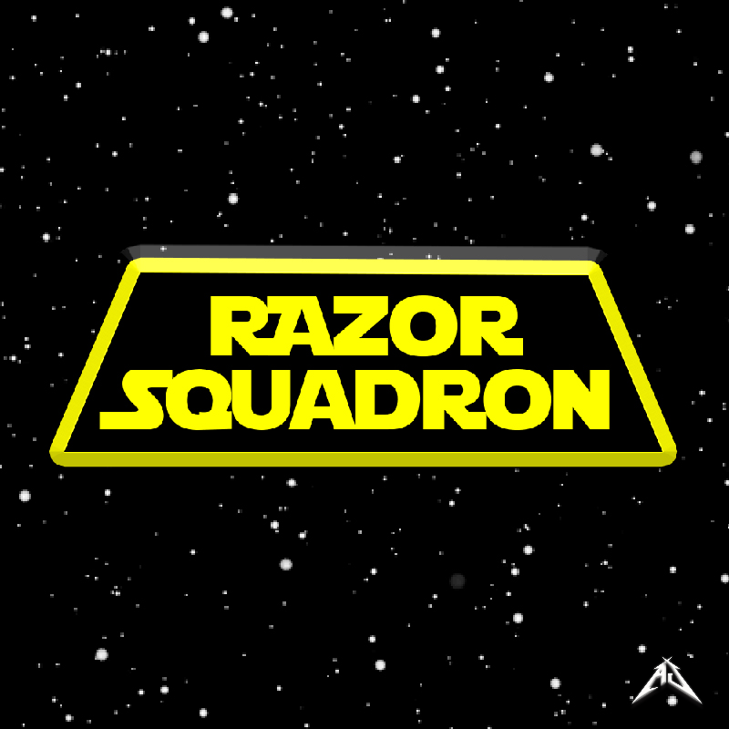

 

  

  <h3 align="center">Razor Squadron</h3>

<!-- ABOUT THE PROJECT -->
## About The Project

Embark on an adrenaline-fueled journey with Razor Squadron, the thrilling 2D shooting game that will push your skills to the limit. In this action-packed adventure, every shot counts as you engage in a relentless battle against enemies, earning points with each successful attack. With a captivating single level, you'll be fully immersed in the heart-pounding action from start to finish. Choose from a diverse selection of ships, each with its own distinct weaponry and speed characteristics, allowing you to customize your playstyle and strategic approach. Get ready to soar through the skies, unleash devastation upon your adversaries, and prove your prowess as the ultimate aerial warrior. Brace yourself for the high-octane excitement of Razor Squadron and become a legend in the realm of 2D shooting games.

### Built With

* [![Unity][Unity-logo]][Unity-url]

[Unity-logo]: https://img.shields.io/badge/Unity-20232A?style=for-the-badge&logo=react&logoColor=61DAFB
[Unity-url]: https://unity.com/

## DevLogs

### Version 1.0.0
- Single level
- Single player character

### Version 2.0.0 - 12/05/2020 Update
- Revamped Main Menu (better interface and design)
- Added 3 ships (Y-Wing, A-Wing, MAAT)
- X-Wing has 4 new designs, Y-Wing has 4 designs, A-Wing has 4 designs, MAAT has 4 designs
- Ships vary in speed, projectiles, and projectile spawn positions
- Projectiles such as homing missiles and proton torpedoes are added
- Implemented loading screen
- Implemented ship selection and design selection screen
- When selecting ships, high scores are displayed
- Fixed buggy UI from the previous version (UI scaling with screen)
- Buttons now have highlighted versions and clicked versions for better interaction

## Download

Download Link: https://xcboi2k.itch.io/razor-squadron
